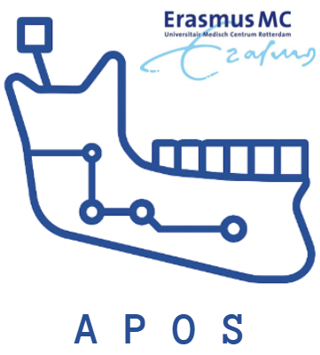
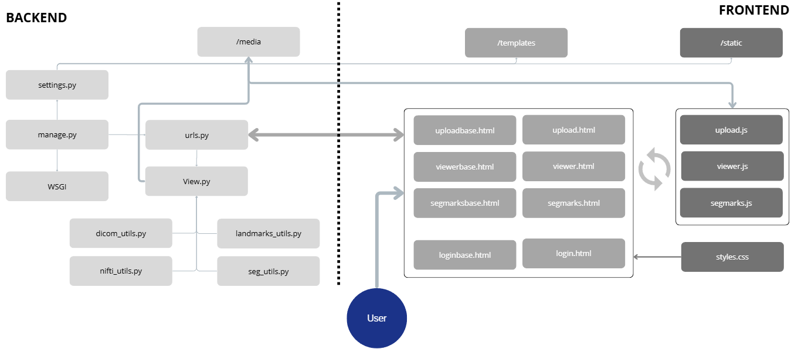

<p align="center">
  
</p>

# Automated Planning for Orthognatic Surgery (APOS) 

Version 1.5

A graphical user interface (GUI) for automated 3D planning in orthognathic surgery.  
Built with **Django**, **VTK.js**, and standard web technologies 
to process, visualize, and interact with DICOM, NIfTI, segmentations, and landmarks volumes.

---

## Features
- Simultaneously visualize generated segmentations and landmarks on anatomy.
- Upload and processing of:
  - DICOM folders → NIfTI → Binary
  - NIfTI files → Binary
  - Segmentation masks (NIfTI) → Volume overlay
  - Landmark JSONs → Voxelized volume -> Volume overlay
- 2D and 3D volume visualization using VTK.js
- Full reset and toggle visibility per dataset

---

## Tech Stack

- **Backend:** Django (Python)
- **Frontend:** HTML, CSS, JavaScript (VTK.js, Bootstrap)
- **3D Engine:** VTK.js
- **Conversion utils:** nibabel, dicom2nifti, numpy, scipy

---

## Getting Started

These instructions assume you're using **Visual Studio Code (VS Code)** on Windows, macOS, or Linux.

### 1. Clone the Repository

```bash
git clone https://github.com/your-username/orthognathic-planner.git
cd orthognathic-planner
```

### 2. Open in VS Code

```bash
code .
```

> The Django project is located in the root folder. Main app: `interface/`.

---

### 3. Create a Python virtual environment

```bash
python -m venv venv
```

### 4. Activate the environment

- On Windows:
  ```bash
  venv\Scripts\activate
  ```
- On macOS/Linux:
  ```bash
  source venv/bin/activate
  ```

### 5. Install dependencies

```bash

pip install django dicom2nifti nibabel numpy scipy
```

---

### 6. Start the development server

```bash
python manage.py runserver
```

### 7. Open the app

after runserver, visit [http://127.0.0.1:8000](http://127.0.0.1:8000) in your browser.

---

## Login Access

Use the following access code to log in:

```text
1234
```

---

## Project Structure Overview

```
├── interface/
│   ├── views.py          # Main view logic (upload, visualize, etc.)
│   ├── urls.py           # URL routing
│   ├── templates/        # HTML templates
│   ├── static/
│   │   ├── js/           # Frontend logic (VTK visualization)
│   │   └── css/          # Custom styles
│   └── utils/            # Data processing helpers
├── media/                # Uploaded and processed files
├── templates/            # Global template directory
├── manage.py             # Django runner
├── settings.py           # Django config

<p align="center">
  
</p>

```

---

## Media Storage

Uploaded volumes and generated binaries are stored in:

```
/media/
```

> This folder is auto-created and used by both frontend and backend.

---

## Useful Development Commands

```bash
# Run development server
python manage.py runserver

# Apply migrations
python manage.py migrate

# Create superuser (if needed)
python manage.py createsuperuser

# Clear media files (manual cleanup)
rm -rf media/*
```

---

## Authors

Developed for research and prototyping in cranio-maxillofacial planning at the ErasmusMC
Author: T.Kortman
t.kortman@erasmusmc.nl
